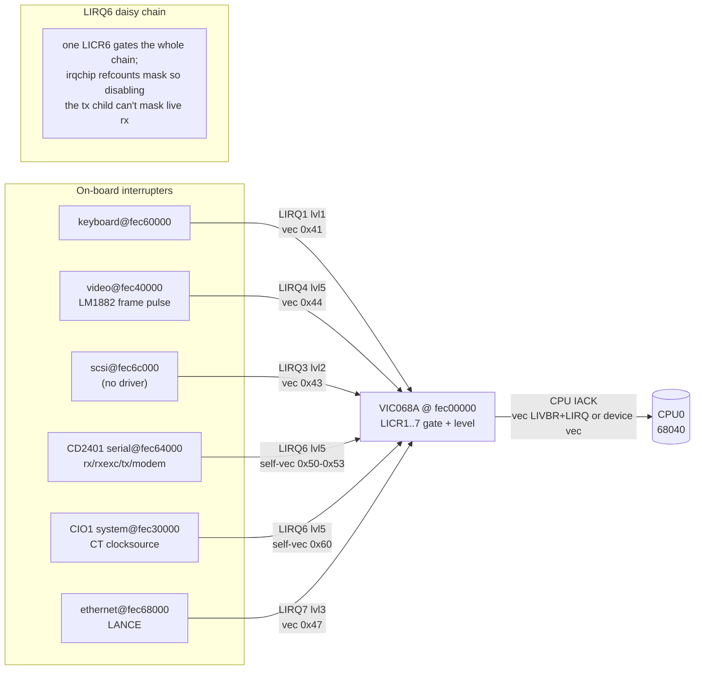
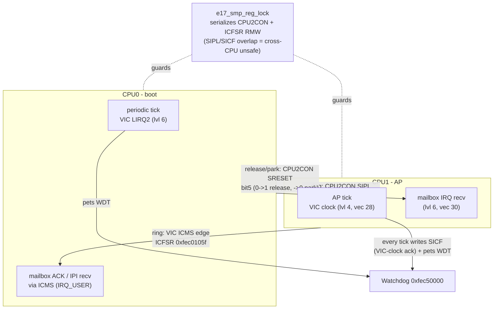
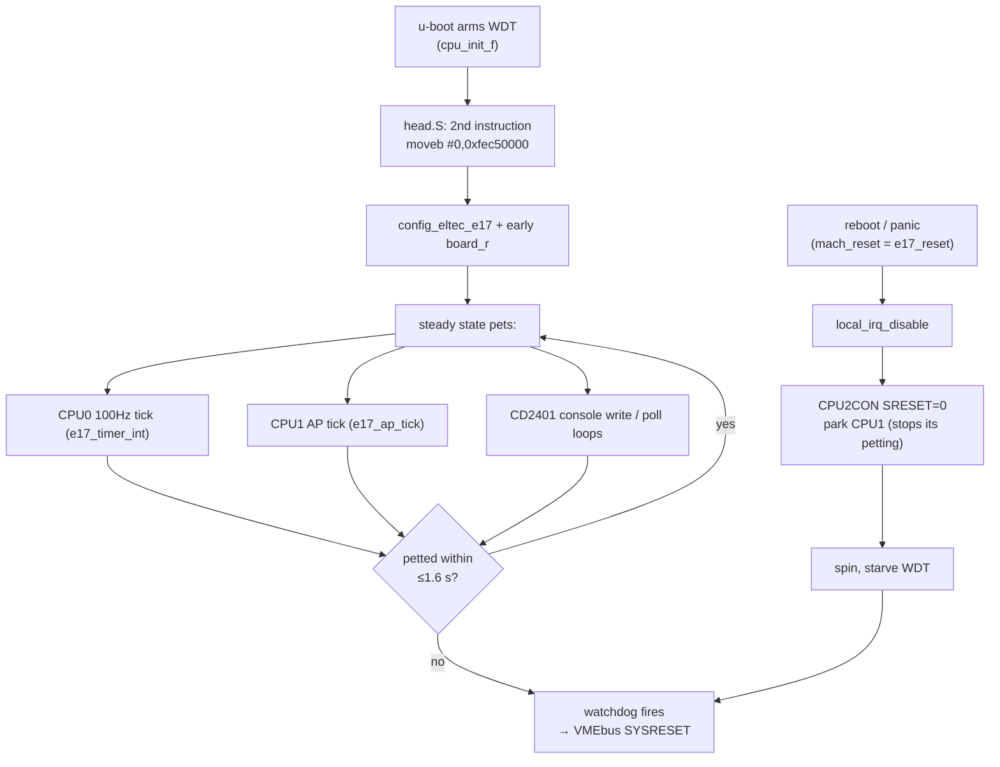
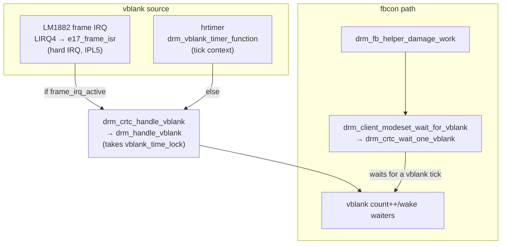
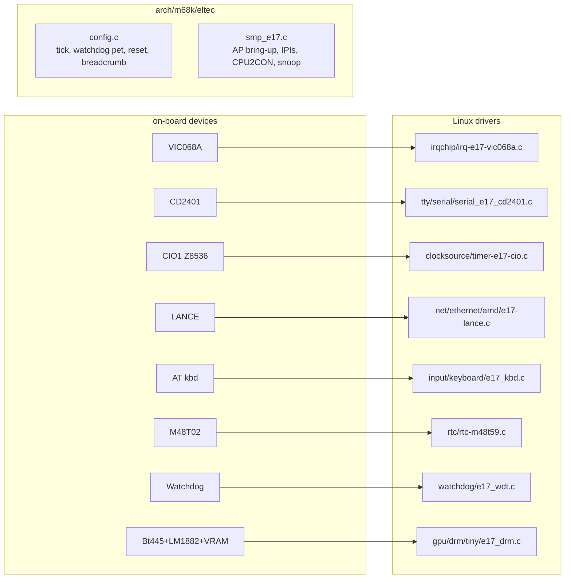

# EUROCOM-17 architecture & interconnect

How the ELTEC EUROCOM-17 (E17) — a dual **MC68040** VMEbus single-board
computer — hangs together: the on-board I/O window, the VIC068A interrupt
topology, the dual-CPU/SMP glue, the watchdog, and how the Linux drivers map
onto all of it. Written to make the drivers reviewable without re-deriving the
wiring each time. Facts here come from `arch/m68k/dts/eltec-e17.dts`,
`drivers/irqchip/irq-e17-vic068a.c`, `arch/m68k/eltec/{config.c,smp_e17.c}`, and
the individual drivers.

> Mermaid diagrams render on GitHub and in most Markdown viewers.

---

## 1. On-board I/O memory map (`0xfec00000` window + VRAM)

Everything on-board lives in the `0xfec00000` I/O window (plus the 1 MB VRAM
aperture at `0x0fc00000`). Addresses are physical; the kernel reaches the I/O
window cache-inhibited.

| Address | Device | Linux driver | Notes |
|---|---|---|---|
| `0xfec00000` | VIC068A interrupt controller | `irqchip/irq-e17-vic068a.c` | LICR1..7 at `0x27+(n-1)*4` |
| `0xfec0105f` | VIC ICFSR (ICMS doorbell) | `eltec/smp_e17.c` | CPU1→CPU0 IPI edge |
| `0xfec10000` | CIO0 (Z8536) | — | `intc_user` vector 1 |
| `0xfec20000` | RTC + NVRAM (M48T02, 2 KB) | `rtc/rtc-m48t59.c` | breadcrumb + MAC live here |
| `0xfec20488` | MAC address (6 plain bytes) | lance / u-boot | **not** the LANCE PROM window |
| `0xfec20600` | reset-surviving breadcrumb | `eltec/config.c`, `watchdog/e17_wdt.c` | per-CPU heartbeats + PCs |
| `0xfec30000` | CIO1 "system" (Z8536) | `clocksource/timer-e17-cio.c` | 7-seg POST, DIP switches, 32-bit clocksource |
| `0xfec40000` | Bt445 RAM-DAC | `gpu/drm/tiny/e17_drm.c` | palette + PLL |
| `0xfec48000` | LM1882 address/sync generator | `e17_drm.c` | CRTC timing |
| `0xfec50000` | Watchdog | `watchdog/e17_wdt.c` | **any write pets; first write arms; can't be disabled** |
| `0xfec54000` | I2C / IPIN + frame-IRQ route | `e17_drm.c` (`irqroute`, +1 only) | ⚠ **reading `0xfec54000` triggers a watchdog/SYSRESET** |
| `0xfec58000` | CPU2CON (secondary control) | `eltec/smp_e17.c` | SRESET, SIPL mailbox, SICF |
| `0xfec5e000` | SNCR (snoop control) | `eltec/smp_e17.c` | cache coherency mode |
| `0xfec60000` | AT keyboard controller | `input/keyboard/e17_kbd.c` | |
| `0xfec64000` | CD2401 serial (chan 0 = console) | `tty/serial/serial_e17_cd2401.c` | |
| `0xfec66000` | CD2401 IACK window | `serial_e17_cd2401.c` | software-IACK at `0x7b` |
| `0xfec68000` | LANCE / ILACC ethernet | `net/ethernet/amd/e17-lance.c` | |
| `0xfec6c000` | 53C720 SCSI | — (no driver yet) | |
| `0x0fc00000` | 1 MB video RAM | `e17_drm.c` | scan-out buffer |

⚠ **Danger addresses** (documented so a driver review doesn't reintroduce them):
- **Read** of `0xfec54000` (I2C/IPIN) stalls the CPU long enough to trip the
  watchdog → **VMEbus SYSRESET resets every board in the crate**. Only ever
  *write* the frame-route byte at `0xfec54001`.
- The **first write** to `0xfec50000` arms the watchdog; software cannot disable
  it thereafter.
- Reading undecoded addresses (e.g. `0xfeb00000`) hangs the bus (watchdog
  recovers).

---

## 2. Interrupt topology (VIC068A)

The VIC068A has seven local inputs **LIRQ1..LIRQ7**. Each has a control register
**LICRn** (`0x27 + (n-1)*4`) with a mask bit (`0x80`), a CPU-level field (bits
2:0) and a read-only raw-pin STATE bit (`0x08`). A line is either:

- **VIC-vectored** — the VIC supplies vector `LIVBR|LIRQ` (`LIVBR = VEC_USER =
  0x40`), so the CPU vector == `0x40|LIRQ`; or
- **self-vectored** — the device supplies its own vector during the CPU IACK
  cycle. On this board **LIRQ6 is a self-vectored daisy chain** carrying the
  CD2401 *and* both CIOs, each on its own vector → its own Linux IRQ, all gated
  by the single LICR6.

Every VIC input is dispatched with `handle_simple_irq` (no HW ack/EOI): the CPU
IACK clears the vector and the SR interrupt-priority-level does the masking. A
device whose ISR can't quench a level-held request would re-vector forever, so
the irqchip has a **per-LICR screaming-source guard** (`E17_VIC_STORM`): if a
line exceeds ~4000/jiffy it is masked and a warning names the LIRQ.

**Per-line summary** (from the DTS):

| LIRQ | CPU level | Vector | Device | Driver |
|---|---|---|---|---|
| LIRQ1 | 1 | 0x41 (VIC) | keyboard | `e17_kbd.c` (has polling backstop) |
| LIRQ2 | 6 | VIC | **CPU0 periodic tick** (VIC clock) | `eltec/config.c` |
| LIRQ3 | 2 | 0x43 (VIC) | SCSI 53C720 | — |
| LIRQ4 | 5 | 0x44 (VIC) | video frame/vblank (LM1882) | `e17_drm.c` |
| LIRQ6 | 5 | self: `0x50` rxexc, `0x51` modem, `0x52` tx, `0x53` rx; `0x60` CIO1 | CD2401 + CIOs | `serial_e17_cd2401.c`, `timer-e17-cio.c` |
| LIRQ7 | 3 | 0x47 (VIC) | LANCE ethernet | `e17-lance.c` |

The CD2401 uses a **shared PILR** (priority level `0xfb`, IACK window `0x7b`):
the driver software-IACKs at that single level and **dispatches on the returned
vector type**, so receive out-ranking transmit inside the chip can't IACK at a
level nothing answers (that was the "type a word and the board dies" hang).
There is **no bus-error timeout** on this board, so an un-DTACKed IACK hangs the
whole bus — hence the care around the IACK window.

---

## 3. Dual-CPU / SMP glue

Two 68040s. CPU0 (boot) releases CPU1 (AP) and they ring each other through two
separate hardware doorbells. All cross-CPU register touches are serialized by
`e17_smp_reg_lock` because **CPU2CON's SIPL/SICF fields overlap** and a
cross-CPU write races corrupt state (this serialization was the major SMP fix
that made `console_rx=1` viable and killed the spurious lockups).

- **CPU0 → CPU1**: write **SIPL** to CPU2CON (`0xfec58000`) with SRESET held —
  the level-6 mailbox IRQ (vector 30) on CPU1.
- **CPU1 → CPU0**: write the **ICMS edge** to the VIC **ICFSR** (`0xfec0105f`)
  — delivered as `IRQ_USER` on CPU0.
- **Bring-up / park**: CPU2CON **SRESET** (bit 5): `0→1` releases the AP, `→0`
  parks it (also used by the offline path and by `e17_reset`).
- **Idle**: `e17_idle=spin` polls for IPIs (register-only bounded spin) instead
  of `stop #0x2000`, which fixed the spontaneous idle lockup.

---

## 4. Watchdog: who pets it, and the reset path

The watchdog (`0xfec50000`) is **armed by u-boot** and cannot be turned off. Any
write pets it; the jumper period is ≤1.6 s. It is petted from **both CPUs'
ticks**, so a CPU0-only stall while CPU1 keeps ticking is **not** caught by the
watchdog alone — which is why `panic_on_rcu_stall=1` exists as the earlier,
finer detector of a half-dead machine.

Because CPU1 keeps petting, a plain `for(;;)` restart would never reset — so
`e17_reset` **parks CPU1 first**, then starves the watchdog. On the next boot
the `e17_wdt` driver prints the **breadcrumb** (`0xfec20600`): both CPUs'
heartbeats, the PC each was interrupted at (`E17_BC_PC`, `E17_BC_CPU1PC`),
`irq_err_count`, the last bad vector, and CPU0's tick source snapshot
(`LICR2`/`SSCR0`). That breadcrumb is the primary evidence for hang analysis —
CPU1's *last-tick PC* is where it was just before it went dark.

---

## 5. Display: frame IRQ, vblank, and the SMP deadlock (fixed)

The DRM/KMS driver (`e17_drm.c`) drives the Bt445 DAC + LM1882 sync generator +
address generator, with an 8bpp (C8) shadow-buffered framebuffer that also backs
fbcon. Two independent knobs:

- `e17_drm.frame_irq=1` — request the LM1882 frame pulse on VIC **LIRQ4**
  (~56 Hz). Counting-only unless vblank is on.
- `e17_drm.vblank=1` — enable DRM vblank. Source is the frame IRQ if it's active,
  else a **fork-local hrtimer** (`drm_crtc_vblank_start_timer`, tied to the tick
  because the board has no high-res clockevent).

**The SMP deadlock (root-caused & fixed — see `logs/real-board/`):**
`drm_crtc_vblank_start_timer()` had a busy-loop `while (hrtimer_active)
hrtimer_try_to_cancel(...)`. `drm_vblank_enable()` calls it **holding
`dev->vblank_time_lock` with IRQs off**, and the timer callback
(`drm_vblank_timer_function → drm_crtc_handle_vblank → drm_handle_vblank`) takes
that **same lock**. If the callback was running on the other CPU: CPU A span
holding the lock waiting for the callback to finish; CPU B (the callback) span
for the lock — cross-CPU deadlock, both IRQs off, both ticks dead → RCU-stall
panic. Fixed by replacing the busy-loop with a single non-blocking
`hrtimer_try_to_cancel()` (`hrtimer_start()` re-arms safely).

- ✅ **`frame_irq=0 vblank=1` (hrtimer path)**: verified working — fbcon +
  vblank ticking + getty-on-tty1, no stalls. This is the recommended vsync path
  (no `handle_vblank` in hard-IRQ context).
- ⚠ **`frame_irq=1 vblank=1`**: still hard-hangs (separate hazard — running
  `drm_crtc_handle_vblank` from the frame ISR in IPL5 hard-IRQ context). Leave
  off.
- **default**: `vblank=0` — fbcon works fine, no vsync.

---

## 6. Device ↔ driver map

---

## 7. Open items (see `logs/real-board/` for detail)

- **UART RX in Linux**: the serial console is currently **output-only**
  (`console_rx=0`); the CD2401 receive path (LIRQ6, self-vectored) is the next
  thing to make robust so the physical serial console is interactive.
- **`frame_irq=1` vblank**: separate hard-IRQ hazard; hrtimer path is the
  working vsync.
- **NVRAM size**: 8 KB part, ~6 KB mapped elsewhere (address TBC).
- **U-boot vidconsole**: framebuffer driver probes, but the generic vidconsole
  text layer crashes on m68k/8bpp (not root-caused).

---

*Board driven over MQTT with `clankercontrol` (`clank`), target `e17`. Its Linux
serial is output-only, so `clank shell` needs `--host`.*
